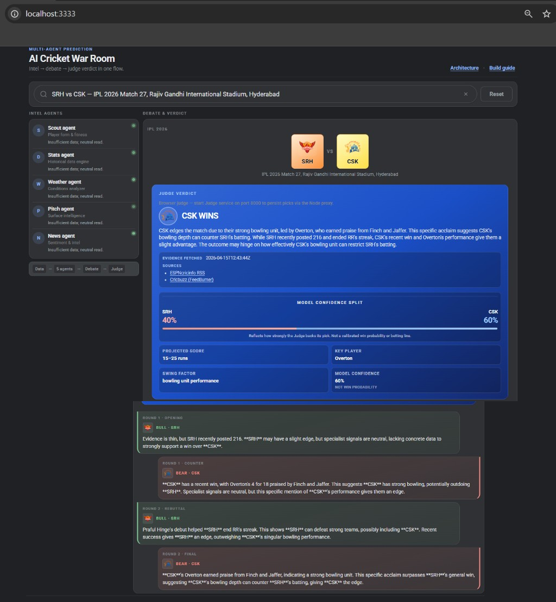
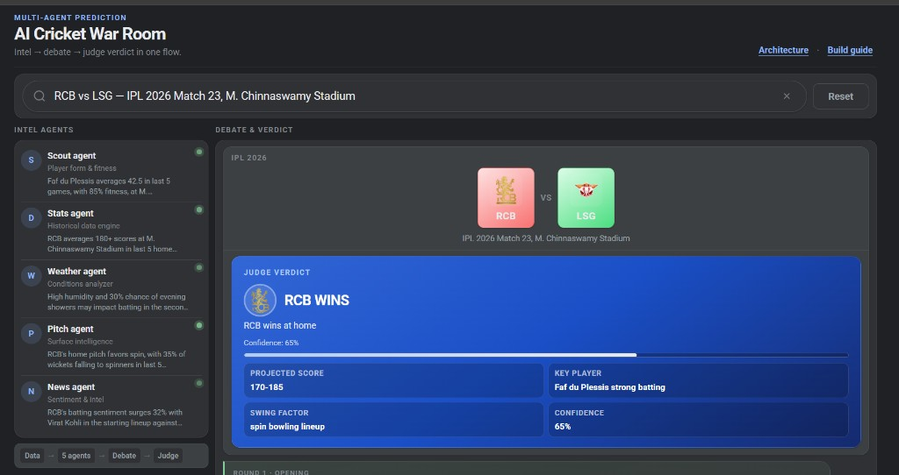
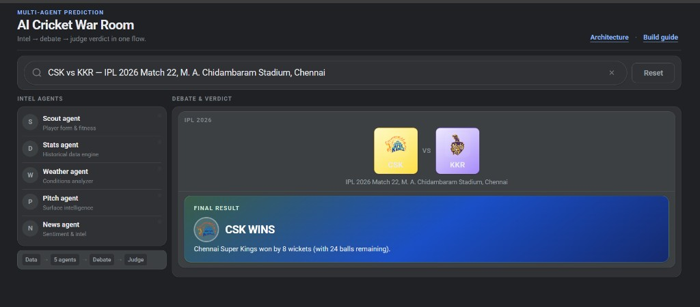
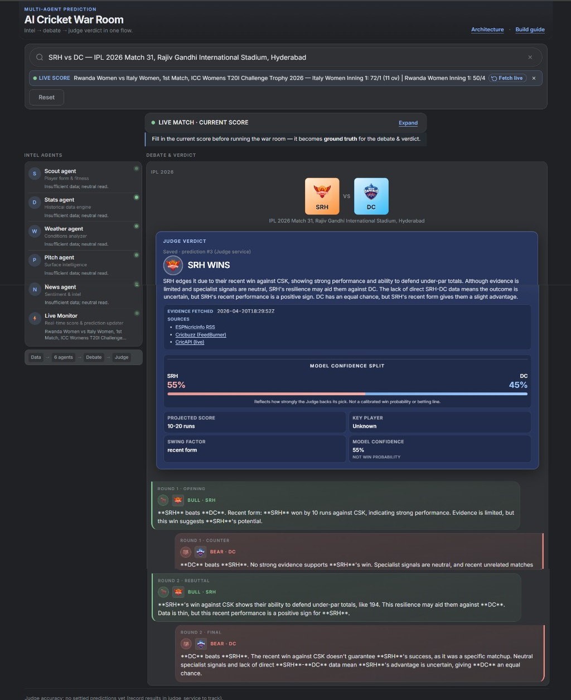

# AI Cricket War Room

A dark-themed web demo for **multi-agent cricket match analysis**: specialist agents gather intel, two adversarial debaters argue the fixture, and a **Judge** produces a structured verdict (winner, confidence, projected score band, key player, swing factor).



*Latest (v2): full prediction flow for SRH vs CSK — five intel agents, multi-round Bull vs Bear debate, and the Judge verdict card (CSK 60% confidence, key player Overton).*

---



*Example: full prediction flow for an upcoming fixture — search, five intel agents, debate stage, and judge verdict card.*



*Example: a **completed** match from `match_suggestions.json` — agents and debate are skipped; only the **Final result** card is shown.*

---



*End-to-end demo: search → intel agents → judge verdict (SRH 55% confidence) → Bull vs Bear debate across three rounds.*

## What it does

- **Search fixtures** via autocomplete backed by `match_suggestions.json` (and `GET /api/match-suggest` when you use the Node server).
- **Intel agents** (Scout, Stats, Weather, Pitch, News) each return a short insight for the selected match.
- **Debate** — Bull (Team A) vs Bear (Team B) over multiple rounds using the same context with opposite directives.
- **Judge** — reads the transcript and returns JSON-style output rendered as the verdict card (winner, confidence bar, stats grid).
- **Completed matches** — if a fixture is marked `completed: true` with a `result` in `match_suggestions.json`, **Run war room** skips agents, debate, and prediction UI and shows a **Final result** card only.

## Quick start

1. **Recommended:** set an LLM API key and start the local server (avoids CORS and hides keys):

   ```bash
   export GROQ_API_KEY="gsk_..."   # free tier: https://console.groq.com
   # or: export ANTHROPIC_API_KEY="sk-ant-..."
   npm start
   ```

   Open [http://localhost:3333/](http://localhost:3333/).

2. Pick a fixture in the search field, then click **Run war room**. Use **Reset** to clear the stage.

3. Opening `ai_cricket_war_room.html` directly (`file://`) uses a built-in fallback fixture list; full autocomplete and `/api/messages` proxy require the server.

## Configuration

| Environment variable | Purpose |
|----------------------|--------|
| `GROQ_API_KEY` | Groq OpenAI-compatible API (default if present). Free tier: [console.groq.com](https://console.groq.com). |
| `GROQ_MODEL` | Override model (default `llama-3.3-70b-versatile`). |
| `ANTHROPIC_API_KEY` | Claude via Anthropic API. |
| `LLM_PROVIDER` | `groq` or `anthropic` to force a provider. |
| `PORT` | HTTP port (default `3333`). |
| `CRICAPI_KEY` | **CricAPI** live scores key. Free tier at [cricapi.com](https://cricapi.com) (~100 calls/day). Set on the ingestion service process. Without it, the ingestion service falls back to RSS-only. |
| `INGESTION_ESPN_RSS_URL` | Override ESPNcricinfo RSS feed URL. |
| `INGESTION_CRICBUZZ_RSS_URL` | Override Cricbuzz FeedBurner RSS URL. |
| `INGESTION_FETCH_TIMEOUT_SEC` | Per-source HTTP timeout in seconds (default `8`). |
| `INGESTION_CACHE_TTL_SEC` | Ingestion cache TTL in seconds (default `900`). Set `0` to disable. |
| `INGESTION_DISABLE` | Set `1` to disable the ingestion service entirely. |

### Live data setup (CricAPI)

1. Register at [cricapi.com](https://cricapi.com) to get your free API key.
2. Export it **before** starting the ingestion service:

   ```bash
   export CRICAPI_KEY="your_key_here"
   python -m uvicorn ingestion_service.app:app --host 127.0.0.1 --port 3334
   ```

3. CricAPI live match bullets are prepended to `news_bullets` so all five intel agents see them first. The `live_score_snippet` field (used by the Scout/Stats agents) is populated from CricAPI structured scores when available, falling back to RSS-scraped headlines.

## API (Node server)

- `POST /api/messages` — proxies to Groq or Anthropic (Anthropic-shaped request body from the front end).
- `GET /api/match-suggest?q=&limit=` — filtered fixture suggestions.
- `GET /api/match-by-label?label=` — exact label lookup (used for completed-match detection when served from the server).

## Data: fixtures and results

Edit **`match_suggestions.json`**. Each entry can include:

- `label`, `date`, `venue`, `teams` (optional short codes).
- **`completed`** + **`result`**: `{ "winner": "RCB", "summary": "…" }` — winner should match team codes; the UI then shows only the final result for that label.

Keep the same rows in **`MATCH_SUGGESTIONS_FALLBACK_ROWS`** inside `ai_cricket_war_room.js` if you rely on offline / fallback behavior.

Restart **`node server.mjs`** after changing the JSON file so the server reloads suggestions.

## Project layout

| Path | Role |
|------|------|
| `ai_cricket_war_room.html` | App shell |
| `ai_cricket_war_room.css` | Layout and theme |
| `ai_cricket_war_room.js` | Agents UI, debate, judge, autocomplete, completed-match shortcut |
| `server.mjs` | Static host + LLM proxy + match APIs |
| `match_suggestions.json` | Fixture catalog |
| `judge_service/` | Separate Python FastAPI service (predictions / accuracy) — optional to this static PoC |
| `openclaw/README.md` | Optional: how to re-home ingestion / intel / debate / judge as OpenClaw tool nodes while keeping this UI as a thin client |

## License / assets

Team logos load from public Wikimedia URLs configured in `ai_cricket_war_room.js`. Replace or host your own assets if you ship this beyond a demo.
