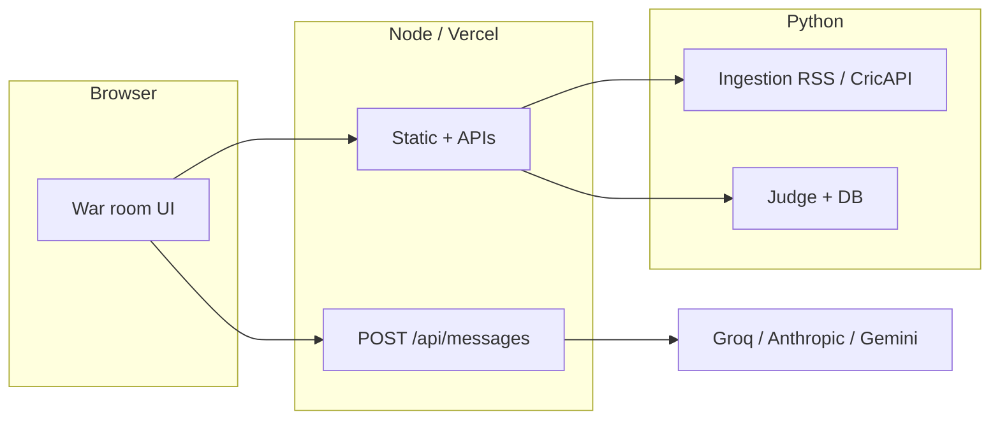

# Cricket War Room

> **Five intel agents plus Bull vs Bear debate a fixture. One Judge delivers the verdict.**

Scout → Stats → Weather → Pitch → News → **multi-round Bull vs Bear** → structured prediction (winner, confidence, score band, key player, swing factor).

**[Live demo](https://cricket-war-room.vercel.app)** · **[Deploy](#deploy)** · **[Share links](#share-links)**

**Disclaimer:** for **entertainment and fan discussion only**. AI outputs are **not** betting, trading, financial, or professional advice; they can be wrong. The live app repeats this in the header and footer.

---

## What makes it different

Most “AI sports” demos stop at one headline prediction. Here the **debate transcript** matters: Bull vs Bear argue over the same grounded context for several rounds before the Judge synthesizes a verdict—shareable and closer to how analysts disagree than a one-shot percentage.

---

## Architecture



1. User picks a fixture (`match_suggestions.json` or `GET /api/match-suggest`).
2. Optional **match context** from ingestion (`GET /api/match-context`) grounds the agents.
3. **Five intel agents** run in parallel via `POST /api/messages`.
4. **Bull vs Bear** multi-round debate uses the same context with opposing goals.
5. **Judge** returns strict JSON; predictions are stored for **accuracy** and **completed-match** UI (pre-match pick vs result).

**Production (Vercel):** the main app is a Node serverless function; **Judge** routes are **Python** functions under `api/judge/*.py` that bundle `judge_service/` (see `vercel.json`). **Ingestion** stays a separate FastAPI process you host (e.g. Render) and point to with `INGESTION_SERVICE_URL`.

**Optional [Upstash](https://upstash.com) Redis** (`UPSTASH_REDIS_REST_URL` + `UPSTASH_REDIS_REST_TOKEN`): shared HTTP caching (e.g. Judge accuracy), distributed rate-limit state, and freemium run counts across cold starts. Omit it for local-only dev; Python Judge routes use the same env vars via `api/judge/_cache.py`.

---

## Deploy

### Vercel (recommended for this repo)

1. Connect the repo; build is `npm run build`, output `dist/` (see `vercel.json`).
2. Set **LLM** keys and, for Judge + share links in production, **`SUPABASE_URL`** + **`SUPABASE_SERVICE_ROLE_KEY`** (run [`supabase_migrations/migrations/001_initial.sql`](supabase_migrations/migrations/001_initial.sql)).
3. Set **`INGESTION_SERVICE_URL`** to your hosted ingestion base URL if you want live RSS/CricAPI context.
4. Optional: **`UPSTASH_REDIS_*`**, **`WAR_ROOM_API_SECRET`** / **`JUDGE_SERVICE_SECRET`**, freemium vars (below).

Cold starts and platform timeouts apply on free tiers; long agent chains may need Pro or async work if you hit limits.

### Local (no Docker)

```bash
cp .env.example .env   # add at least one LLM key; see comments inside
npm run start:dev      # http://localhost:3333
```

**Full stack:** after `pip install -r requirements-ingestion.txt` and `pip install -r requirements-judge.txt`, use `npm run dev:stack` (Node + ingestion :3334 + judge :8000) or run `ingestion:dev` / `judge:dev` in separate terminals.

`npm run build && npm start` serves hashed assets from `dist/` (`SERVE_DIST=1`).

Opening `ai_cricket_war_room.html` over `file://` uses in-JS fallback fixtures only; use the Node server for autocomplete and `/api/messages`.

### Docker

```bash
cp .env.example .env
docker compose up --build
```

Open [http://localhost:3333/](http://localhost:3333/). Judge data uses the `judge_data` volume unless you use Supabase on the judge container.

### Render (optional blueprint)

[`render.yaml`](render.yaml) can provision web + ingestion + judge. Set `GROQ_API_KEY` (and service URLs as in the blueprint). Prefer **Supabase** on judge for persistence—SQLite on ephemeral disks resets on restart.

---

## Configuration

| Variable | Purpose |
| -------- | ------- |
| `GROQ_API_KEY` / `ANTHROPIC_API_KEY` / `GEMINI_API_KEY` | LLM keys (Node + Judge). `LLM_PROVIDER`: `groq` \| `anthropic` \| `gemini`. |
| `GROQ_MODEL`, `GROQ_MODEL_LIGHT`, `GROQ_MODEL_DEBATE` | Model mix (see `server.mjs` header). |
| `PORT` | Node port (default `3333`). |
| `SERVE_DIST` | `1` → serve production `dist/` assets. |
| `INGESTION_SERVICE_URL` / `JUDGE_SERVICE_URL` | Python service bases (local / Render); on Vercel, Judge is in-process Python—`JUDGE_SERVICE_URL` is for local proxy only. |
| `CRICAPI_KEY` | On **ingestion**; optional live scores. |
| `WAR_ROOM_DB_PATH` | Judge **SQLite** when Supabase env is unset. |
| `SUPABASE_URL` + `SUPABASE_SERVICE_ROLE_KEY` | Judge predictions + share packs in Postgres (preferred in production). |
| `PUBLIC_SITE_URL` | Canonical origin for OG and `/s/{id}` when behind another host. |
| `UPSTASH_REDIS_REST_URL` + `UPSTASH_REDIS_REST_TOKEN` | Optional Redis for caches, rate limits, freemium counts. |
| `FREEMIUM_MAX_RUNS_PER_DAY` | Daily cap on successful Judge runs per IP during IPL live window (IST); default `5`, `0` disables. |
| `IPL_FREEMIUM_ACTIVE` | `1` or `true` forces the freemium window on (testing). |
| `WAR_ROOM_API_SECRET` | If set, `POST /api/messages` and `POST /api/judge/predict` require `Authorization: Bearer …`. UI can store the same value in `localStorage.WAR_ROOM_API_SECRET`. |
| `JUDGE_SERVICE_SECRET` | If set on Judge, all Judge HTTP routes require that Bearer (or `X-Judge-Secret`). Node forwards it when set on the web process—use the **same** value on web + judge. |
| `TRUST_PROXY` | `1` / `true`: use `X-Forwarded-For` for rate-limit IP. |
| `RL_MESSAGES_PER_MIN` / `RL_JUDGE_PER_MIN` | Per-IP caps / 60s (defaults 30 / 15; `0` disables that route’s limit). |
| `MAX_BODY_MESSAGES_BYTES` / `MAX_BODY_JUDGE_BYTES` | Body size caps (defaults 1 MiB / 2 MiB). |
| `ALLOWED_ORIGINS` | Comma-separated CORS origins in production instead of `*`. |
| `INGESTION_EXPOSE_ERRORS` / `INGESTION_RSS_MAX_BYTES` | Ingestion debugging and RSS download cap. |

---

## Judge, accuracy, and persistence

When the Judge API is enabled, the UI shows **running accuracy** and can load **saved pre-match predictions** on completed fixtures.

- **SQLite** (`WAR_ROOM_DB_PATH` or default `data/war_room.db`): fine for `npm run judge:dev` and Docker.
- **Supabase Postgres** (preferred): set `SUPABASE_URL` + `SUPABASE_SERVICE_ROLE_KEY` on the Judge process. Schema: [`supabase_migrations/migrations/001_initial.sql`](supabase_migrations/migrations/001_initial.sql).

**Freemium:** during an IPL “live” day (catalog has a non-completed fixture on today’s IST date, or `IPL_FREEMIUM_ACTIVE=1`), each successful `POST /api/judge/predict` increments a per-IP counter up to `FREEMIUM_MAX_RUNS_PER_DAY`. When the cap is reached, both `POST /api/messages` and `POST /api/judge/predict` return 429 until the next IST calendar day. `GET /api/freemium-status` drives the UI pill. Clients presenting `WAR_ROOM_API_SECRET` bypass the cap when that secret is configured.

---

## Share links

Open the app with `?share=` to pre-fill the fixture field: **exact** catalog label, or a **short** line (team codes in either order, optional comma + city/venue to disambiguate). No run until the user clicks **Run war room**.

**Exact label example:**

```text
https://cricket-war-room.vercel.app/?share=DC%20vs%20SRH%20%E2%80%94%20IPL%202026%20Match%2031%2C%20Rajiv%20Gandhi%20International%20Stadium%2C%20Hyderabad
```

**Shorter resolved example:**

```text
https://cricket-war-room.vercel.app/?share=IPL%202026%20%E2%80%94%20SRH%20vs%20DC%2C%20Hyderabad
```

**Open Graph:** `og:image` for the homepage is `GET /og-homepage.png` (Sharp, 1200×630); shared predictions use `GET /api/og/share/{id}.png`. HTML uses a `?v=` cache-buster when the card design changes. Use `PUBLIC_SITE_URL` (or request host) so previews match the deployed hostname. After deploys, refresh caches with the [Facebook Sharing Debugger](https://developers.facebook.com/tools/debug/).

**Share this prediction:** after a full run, **SHARE THIS PREDICTION** saves a snapshot and returns `/s/{id}`. That view shows the verdict card without re-running agents; **Run full war room** loads intel, context, and debate.

Example: [https://cricket-war-room.vercel.app/s/ba91b4c5](https://cricket-war-room.vercel.app/s/ba91b4c5)

---

## Screenshots

Production UI (IPL example: **DC vs RCB, Delhi**). Order: **(3) home** → **(1) after search** → **(2) after prediction**.

### 3) Homepage — before Run war room


### 1) After search


### 2) After full prediction


### Shared prediction link


---

## API (Node gateway)

| Method | Path | Role |
| ------ | ---- | ---- |
| POST | `/api/messages` | LLM proxy (intel, debate, live turns). |
| GET | `/api/match-suggest`, `/api/match-by-label` | Fixture catalog. |
| GET | `/api/match-context` | Proxy to ingestion. |
| GET | `/api/live-score` | Score JSON; `fresh=1` forces upstream refresh. |
| POST | `/api/judge/predict` | Run Judge + store prediction. |
| GET | `/api/judge/accuracy` | Running accuracy stats (also routed as `/api/accuracy` on Vercel). |
| GET | `/api/judge/predictions-by-match` | Saved predictions for a `match_id` (completed-match “view pre-match pick”). |
| GET | `/api/judge/recent-settled` | Latest settled predictions (ledger / trust UI). |
| GET | `/api/freemium-status` | Freemium cap status for the client IP. |
| GET | `/api/version` | Build metadata (minimal fields in production when configured). |
| POST | `/api/share-prediction` | Create short share id; GET `/api/share/:id` returns pack JSON. |

---

## Data: fixtures

Edit `match_suggestions.json`. Optional `completed` + `result` (`winner`, `summary`, and optional POTM fields) skips agents/debate and drives post-match cards. Restart Node after edits. Mirror critical rows in `MATCH_SUGGESTIONS_FALLBACK_ROWS` in `ai_cricket_war_room.js` for offline `file://`.

### Fixture status

Each catalog row is classified by `getMatchStatus()` in `ai_cricket_war_room.js`. The status drives the dropdown badge, ordering, and whether the war-room flow runs agents or jumps straight to the result/past-match view.

| Status | When it applies |
| ------ | --------------- |
| `COMPLETED` | `completed: true` with a recorded `result.winner`. Skips agents; renders the post-match card (verdict + POTM). |
| `LIVE` | `date` = today **and** a live score snippet is present in `result` / live-score cache (in-flight match). |
| `TODAY` | `date` = today, no live score yet (pre-toss / awaiting first ball). |
| `UPCOMING` | `date` > today. |
| `PAST` | `date` < today but **not** flagged `completed` — date-based fallback guard so missing flags still skip agents. |
| `TBD` | No date or non-ISO date (e.g. playoff placeholders like `IPL 2026 Final — TBD`). No badge is shown. |

---

## Project layout

| Path | Role |
| ---- | ---- |
| `ai_cricket_war_room.{html,css,js}` | UI, debate, share param, prompts |
| `server.mjs` | Static host, APIs, `SERVE_DIST` |
| `api/index.mjs` | Vercel Node entry |
| `api/judge/*.py` | Vercel Judge serverless handlers |
| `scripts/build.mjs` | Production `dist/` + assets |
| `match_suggestions.json` | Fixture catalog |
| `ingestion_service/` | FastAPI RSS / CricAPI |
| `judge_service/` | FastAPI Judge + SQLite / Supabase stores |
| `lib/redis.js`, `middleware/freemiumLive.mjs` | Optional Redis + freemium |
| `vercel.json`, `render.yaml`, `docker-compose.yml`, `Dockerfile*` | Deploy |

---

## License / assets

Team logos may load from public Wikimedia URLs in `ai_cricket_war_room.js`. Replace for production if needed.
