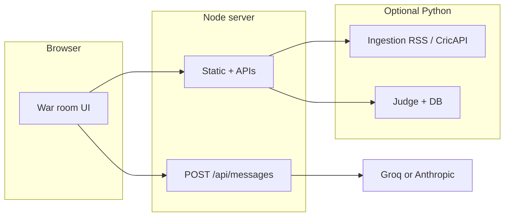
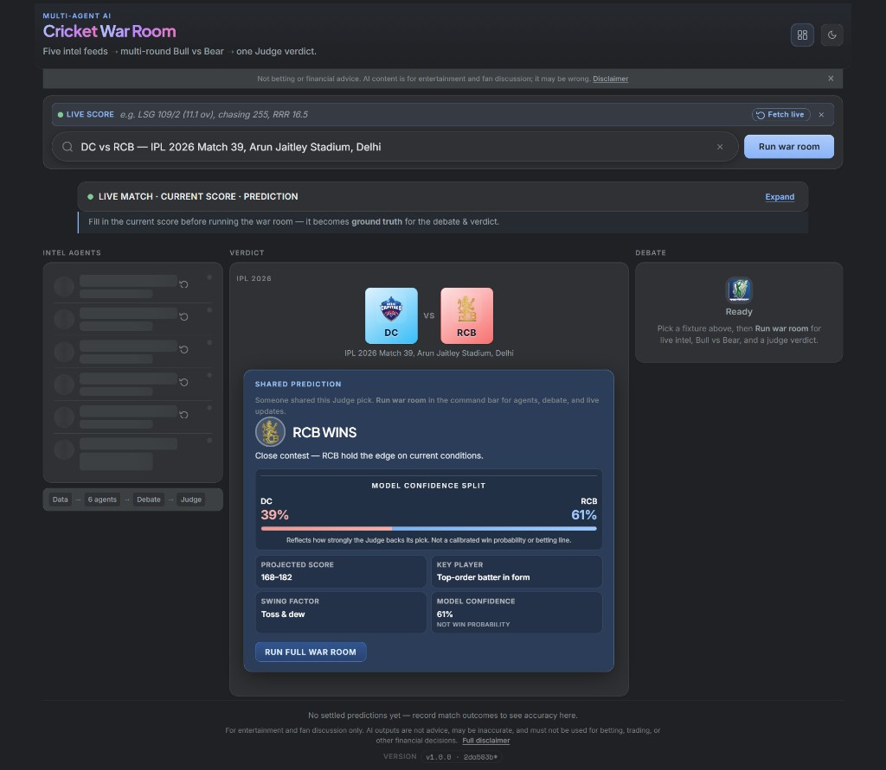
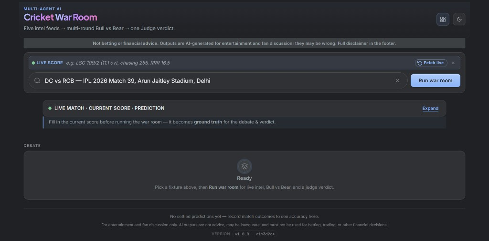
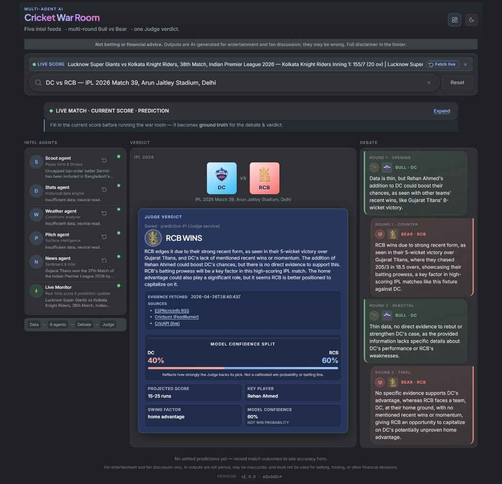

# Cricket War Room

> **Six AI roles debate a live fixture. One Judge delivers the verdict.**

Scout → Stats → Weather → Pitch → News → **multi-round Bull vs Bear** → structured prediction (winner, confidence, score band, key player, swing factor).

**[Live demo](https://cricket-war-room.onrender.com)** · **[Deploy to Render](#deploy-to-render-free)** · **[Railway / Fly.io](#alternative-hosts-railway-and-flyio)** · **[Share a fixture](#share-links)**

**Disclaimer (read first):** this product is for **entertainment and fan discussion only**. AI outputs are **not** betting, trading, financial, or professional advice; they can be wrong. The live app repeats this below the header and in the footer.

---

## Why it exists

Most “AI sports” demos stop at a single headline prediction. The differentiator here is the **debate transcript**: two adversarial voices (Bull vs Bear) argue over the same grounded context across several rounds before the Judge synthesizes a verdict. That transcript is the asset—shareable, readable, and closer to how analysts actually disagree than a one-shot percentage.

**Positioning / timing:** Tournaments such as **IPL** concentrate search and social traffic for a short window (typically **late March–May**). If you care about discovery, ship **indexed pages, OG previews, and shareable URLs before the first match**, not mid-tournament.

**Example monetisation angles** (PoC only—not implemented as billing here): freemium caps on automated runs; fantasy-app referral partnerships; B2B API for publishers who want debate + verdict widgets.

---

## Architecture



1. User picks a fixture (`match_suggestions.json` or `GET /api/match-suggest`).
2. Optional **match context** from ingestion (`GET /api/match-context`) grounds the agents.
3. **Five intel agents** run in parallel via `POST /api/messages`.
4. **Bull vs Bear** multi-round debate uses the same context with opposing goals.
5. **Judge** returns strict JSON; optional **Judge service** stores predictions for accuracy.

### Server hardening (optional)

The Node gateway enforces **max body sizes** on `POST /api/messages`, Judge proxy, and share payloads; **sliding-window rate limits** per IP on LLM and Judge predict routes; and **minimal `/api/version`** when `NODE_ENV=production` or `VERSION_INFO_MINIMAL=1` (no git hashes in JSON).

| Variable | Purpose |
|----------|---------|
| `WAR_ROOM_API_SECRET` | If set, `POST /api/messages` and `POST /api/judge/predict` require `Authorization: Bearer <secret>`. The UI reads the same value from **`localStorage.WAR_ROOM_API_SECRET`** when present (for locked demos). |
| `JUDGE_SERVICE_SECRET` | If set on the **Judge** Python service, all Judge HTTP routes require that Bearer token (or `X-Judge-Secret`). The Node server sends it automatically when this env is set on the web process. Use the **same** value on web + judge. |
| `TRUST_PROXY` | `1` or `true`: use `X-Forwarded-For` first hop for rate-limit client IP (e.g. behind Render). |
| `RL_MESSAGES_PER_MIN` / `RL_JUDGE_PER_MIN` | Per-IP caps in a 60s window (defaults **30** / **15**; set `0` to disable that limit). |
| `MAX_BODY_MESSAGES_BYTES` / `MAX_BODY_JUDGE_BYTES` | Request body caps (defaults **1 MiB** / **2 MiB**). |
| `ALLOWED_ORIGINS` | Comma-separated list; when set, CORS reflects a matching `Origin` instead of `*`. |
| `INGESTION_EXPOSE_ERRORS` | `1` on ingestion: return real exception text in 502 JSON (default: generic `ingestion_failed`). |
| `INGESTION_RSS_MAX_BYTES` | Max RSS download size before parse (default **2 MiB**). |

---

## Judge accuracy & persistence

When the Judge API is enabled, the UI can show **running accuracy** (predictions where an actual winner was recorded vs the model’s pick).

- **Render free + file SQLite** (`WAR_ROOM_DB_PATH=/tmp/...`): the database **dies on restart**—fine for demos, weak for a credibility story.
- **Turso (libSQL)** — set on the **Judge** process:
  - `TURSO_DATABASE_URL` — e.g. `libsql://your-db.turso.io`
  - `TURSO_AUTH_TOKEN` — from the Turso dashboard  
  When both are set, the service uses **remote libSQL** via the `libsql` package (see `requirements-judge.txt`) and **ignores local file path** for storage. That turns accuracy into a metric that survives deploys and cold starts.

Create a DB in [Turso](https://turso.tech), install deps, run the judge as usual; no schema migration is required beyond the app’s `CREATE TABLE IF NOT EXISTS`.

---

## Share links

Open the app with `?share=` to pre-fill the fixture field. The value can be the **exact** catalog label, or a **shorter** line: team codes in either order (e.g. `SRH vs DC` or `DC vs SRH`) plus an optional **city/venue** hint after a comma to disambiguate (e.g. `Hyderabad`). The app resolves to the real `match_suggestions` row and fills the search box (no run until the user clicks **Run war room** — no surprise token use).

**Exact label example:**

```text
https://cricket-war-room.onrender.com/?share=DC%20vs%20SRH%20%E2%80%94%20IPL%202026%20Match%2031%2C%20Rajiv%20Gandhi%20International%20Stadium%2C%20Hyderabad
```

**Shorter (resolved automatically) example — same match:**

```text
https://cricket-war-room.onrender.com/?share=IPL%202026%20%E2%80%94%20SRH%20vs%20DC%2C%20Hyderabad
```

**Open Graph:** the main app HTML points `og:image` at **`GET /og-homepage.png`** (1200×630, logo + headline + agent strip, Sharp). The URL in HTML includes a **`?v=`** query (increment when the card design changes) so Meta/WhatsApp do not keep serving an old cached bitmap. For **`/s/{id}`** share links, crawlers get HTML whose `og:image` is **`GET /api/og/share/{id}.png`** (same dimensions; per-match verdict with logo in the brand bar and verdict column). Logo file: `image/ai-cricket-war-room-logo.png` (embedded as base64 in the SVG at render time). After deploys, refresh previews with [Facebook Sharing Debugger](https://developers.facebook.com/tools/debug/) (**Scrape Again** a few times); WhatsApp uses the same scraper cache for `og:image`.

**Share this prediction** (after a full war-room run): the verdict card’s **SHARE THIS PREDICTION** button saves a compact snapshot and returns a short URL under `/s/{id}`. Opening that link loads the **Shared prediction** card (Judge pick, confidence split, score band, key player, swing factor) without re-running agents; use **Run full war room** in the command bar when you want intel agents, live context, and the full Bull vs Bear debate.

[](https://cricket-war-room.onrender.com/s/ba91b4c5)

**Example link:** [https://cricket-war-room.onrender.com/s/ba91b4c5](https://cricket-war-room.onrender.com/s/ba91b4c5) *(IPL 2026 — DC vs RCB, Delhi; same saved pick as above.)*

---

## Screenshots

Latest production captures from [cricket-war-room.onrender.com](https://cricket-war-room.onrender.com) (IPL 2026 example: **DC vs RCB, Delhi**). Order: **(3) home** → **(1) after search** → **(2) after full prediction** (over-by-over flow through agents, debate, and Judge).

### 3) Homepage — before **Run war room**

The disclaimer strip is visible, a fixture is in the search field, live / ground-truth areas are available, and the **Debate** stage is **Ready** (nothing run yet).



### 1) After search

Fixture locked in, command row active (**Run war room** / **Reset**), **LIVE MATCH · CURRENT SCORE** / ground-truth block expanded so you can align the model with the real line before a full run.



### 2) After over-by-over prediction

Full run: all **intel agents** filled in, **Judge verdict** (winner, confidence, score band, key player, swing factor), and **Bull vs Bear** multi-round debate. Model confidence and sources (RSS / Cricbuzz / CricAPI) surface on the verdict card.


---

<!-- Legacy gallery (hidden in rendered README — keep paths for history)


-->

## Free-tier infrastructure (honest trade-offs)

| Piece | Limitation | Free / low-cost direction |
|-------|----------------|---------------------------|
| Render free web | Cold start ~30s after idle | [Railway](https://railway.app) ($5/mo credit), paid Render, or self-host Docker |
| SQLite on `/tmp` | Resets → accuracy looks fake | **[Turso](https://turso.tech)** remote libSQL (wired in `judge_service/predictions_db.py`) |
| CricAPI free tier | ~100 calls/day on busy days | RSS (ESPN + Cricbuzz) already used; CricAPI optional |
| Social previews | Need stable absolute `og:image` | Use a static PNG under `/image/` (e.g. `readme-state-02-after-prediction.png`); set `og:image` in `ai_cricket_war_room.html` to match. |

### Monitoring & analytics (implemented)

- **[UptimeRobot](https://dashboard.uptimerobot.com/monitors)** — Monitors the live site’s HTTP availability and sends alerts when checks fail or recover.
- **[Umami](https://cloud.umami.is/analytics/us/websites/256a7586-1d61-4adc-b10f-9b1a322e3cac)** — Privacy-friendly web analytics (page views, referrers, traffic) for the deployed app without heavy third-party tracking scripts.

---

## Deploy to Render (free)

[](https://render.com/deploy)

1. Push this repo to GitHub.
2. [dashboard.render.com](https://dashboard.render.com) → **New** → **Blueprint** → select the repo (`render.yaml` provisions three services).
3. Set environment variables in the dashboard (minimum **`GROQ_API_KEY`** on `cricket-war-room` and `cricket-judge`; URLs for ingestion/judge as in the table below).
4. **Optional but recommended for Judge accuracy:** on `cricket-judge`, add **`TURSO_DATABASE_URL`** and **`TURSO_AUTH_TOKEN`** so predictions survive restarts.

| Service | Variable | Value |
|---------|----------|-------|
| `cricket-war-room` | `GROQ_API_KEY` | [console.groq.com](https://console.groq.com) |
| `cricket-war-room` | `INGESTION_SERVICE_URL` | `https://cricket-ingestion.onrender.com` |
| `cricket-war-room` | `JUDGE_SERVICE_URL` | `https://cricket-judge.onrender.com` |
| `cricket-ingestion` | `CRICAPI_KEY` | optional |
| `cricket-judge` | `GROQ_API_KEY` | same as above |
| `cricket-judge` | `TURSO_DATABASE_URL` / `TURSO_AUTH_TOKEN` | optional persistence |

> **Free-tier note:** web services **spin down** after idle — first request can take ~30s. Without Turso, **`WAR_ROOM_DB_PATH=/tmp`** still loses SQLite on restart.

---

## Alternative hosts: Railway and Fly.io

Same three-process layout as [render.yaml](render.yaml): **Node web** (UI + `/api/*`), optional **ingestion** and **judge** Python services. Env vars match the [Render deploy table](#deploy-to-render-free) (`INGESTION_SERVICE_URL`, `JUDGE_SERVICE_URL`, LLM keys, optional `JUDGE_SERVICE_SECRET`, `TRUST_PROXY=1` behind a reverse proxy).

**Choosing:** use **Railway** when you want the quickest dashboard-driven setup and usage-based billing. Use **Fly.io** when you want **Machines**, explicit **volumes** for Judge SQLite, and more control over region and scale. Either way, **Turso** on the judge process is still the most reliable persistence on ephemeral disks ([Judge accuracy & persistence](#judge-accuracy--persistence)).

### Railway

#### Step-by-step (dashboard)

1. **Account** — Go to [railway.app](https://railway.app), sign in (GitHub is easiest), and approve Railway’s access to your GitHub account if prompted.

2. **New project from this repo** — **New Project** → **Deploy from GitHub repo** → pick this repository and branch (usually `main`). Railway creates an initial **service**; treat it as the **web (Node)** service.

3. **Rename services (recommended)** — In the project canvas, rename the first service to something like `web`. You will add two more services next.

4. **Web (Node) service — build** — Select the web service → **Settings** (or **Build**). Ensure the image builds from the root **[Dockerfile](Dockerfile)**. If the repo has [railway.toml](railway.toml) at the root, Railway often picks **Dockerfile** automatically for services using that config. If Railway tries **Nixpacks** instead, switch the builder to **Dockerfile** and set the Dockerfile path to `Dockerfile`. No custom start command is required (the Dockerfile already runs `node server.mjs`). **Redeploy** if you changed build settings.

5. **Web — public URL** — Same service → **Networking** (or **Settings → Networking**) → **Generate domain** (or attach a custom domain). Copy the HTTPS base URL (e.g. `https://web-production-xxxx.up.railway.app`). You will open this in the browser after Python URLs exist.

6. **Add Ingestion (Python)** — In the project: **New** → **GitHub Repo** → **same repository** again. This creates a second service; rename it to `ingestion`.

7. **Ingestion — build & start** — Select `ingestion` → **Settings → Build**: set **Dockerfile path** to `Dockerfile.python` (not the root Node Dockerfile). If Railway still builds the wrong image because it reads [railway.toml](railway.toml), look for an option to **override** the Dockerfile / builder for this service only (wording varies; the goal is **Dockerfile.python**). Under **Deploy** (or **Settings → Deploy**), set **Custom Start Command** to:  
   `uvicorn ingestion_service.app:app --host 0.0.0.0 --port $PORT`  
   Railway injects `$PORT`; do not hard-code `3334` here.

8. **Ingestion — networking & env** — **Generate domain** for `ingestion`. In **Variables**, optionally add `CRICAPI_KEY` for live scores. Redeploy and confirm `https://…/healthz` returns JSON in a browser.

9. **Add Judge (Python)** — **New** → **GitHub Repo** → same repo again. Rename the service to `judge`.

10. **Judge — build & start** — Same as ingestion: **Dockerfile path** = `Dockerfile.python`, **Custom Start Command**:  
    `uvicorn judge_service.app:app --host 0.0.0.0 --port $PORT`

11. **Judge — persistence (pick one)**  
    - **Recommended:** In **Variables**, set `TURSO_DATABASE_URL` and `TURSO_AUTH_TOKEN` ([Judge accuracy & persistence](#judge-accuracy--persistence)). No volume required.  
    - **Alternative:** Add a **Volume** on this service (Railway UI: attach volume, mount e.g. `/data`), then set `WAR_ROOM_DB_PATH=/data/war_room.db`.

12. **Judge — networking & secrets** — **Generate domain**. In **Variables**, set at least one of `GROQ_API_KEY` or `ANTHROPIC_API_KEY` (Judge calls the LLM). Optionally set `JUDGE_SERVICE_SECRET`; if you do, set the **same** value on the **web** service as `JUDGE_SERVICE_SECRET` so the Node proxy can authenticate.

13. **Wire the web service to Python** — On the **web** service → **Variables** (raw values, no trailing slash on URLs):

    | Variable | Value |
    |----------|--------|
    | `GROQ_API_KEY` and/or `ANTHROPIC_API_KEY` | Your keys (required for LLM). |
    | `INGESTION_SERVICE_URL` | Full HTTPS base of the ingestion service (step 8). |
    | `JUDGE_SERVICE_URL` | Full HTTPS base of the judge service (step 12). |
    | `TRUST_PROXY` | `1` (so rate limits see the real client IP behind Railway). |

    Optional: `LLM_PROVIDER`, `WAR_ROOM_API_SECRET`, `ALLOWED_ORIGINS` — see [Configuration](#configuration) and [Server hardening](#server-hardening-optional).

14. **Redeploy web** — Trigger a new deploy on the web service after variables are saved. Open the web public URL and run a full war room; confirm live context and judge paths work.

15. **Optional — private networking** — If Railway exposes **internal** URLs for services in the same project, you may use those for `INGESTION_SERVICE_URL` / `JUDGE_SERVICE_URL` instead of public HTTPS; the Node server must be able to reach them from its container.

| Service | Variable | Notes |
|---------|----------|-------|
| Web | `GROQ_API_KEY` / `ANTHROPIC_API_KEY` | At least one required. |
| Web | `INGESTION_SERVICE_URL` / `JUDGE_SERVICE_URL` | Public URLs of the two Python services. |
| Web | `TRUST_PROXY` | Set to `1` behind Railway’s proxy. |
| Ingestion | `CRICAPI_KEY` | Optional live scores. |
| Judge | LLM keys, optional `JUDGE_SERVICE_SECRET` | Match secrets used on the web service when set. |
| Judge | `TURSO_DATABASE_URL` / `TURSO_AUTH_TOKEN` | Optional; preferred over file SQLite on ephemeral disk. |

### Fly.io

1. Install [flyctl](https://fly.io/docs/hands-on/install-flyctl/) and run `fly auth login`.
2. Pick three **globally unique** app names. Either edit the `app` field in [fly.web.toml](fly.web.toml), [fly.ingestion.toml](fly.ingestion.toml), and [fly.judge.toml](fly.judge.toml), or create apps with `fly apps create <name>` and pass `--app <name>` on every `fly deploy` / `fly secrets` command.
3. **Secrets** (repeat per app, from the repo root), for example:  
   `fly secrets set GROQ_API_KEY=... --config fly.web.toml --app <web-app>`  
   On the web app, also set `INGESTION_SERVICE_URL` and `JUDGE_SERVICE_URL` to `https://<ingestion-app>.fly.dev` and `https://<judge-app>.fly.dev` (or your custom domains).
4. **Judge SQLite:** create a volume in the **same region** as `primary_region` in [fly.judge.toml](fly.judge.toml), e.g.  
   `fly volumes create war_room_judge_data --region iad --size 1 --app <judge-app>`  
   The volume name must match `source` under `[mounts]` in [fly.judge.toml](fly.judge.toml). If you use **Turso only**, remove the `[mounts]` block from that file before deploy (or leave the volume unused).
5. Deploy (from repo root):  
   `fly deploy --config fly.web.toml --app <web-app>`  
   `fly deploy --config fly.ingestion.toml --app <ingestion-app>`  
   `fly deploy --config fly.judge.toml --app <judge-app>`

---

## Run with Docker

```bash
cp .env.example .env   # fill GROQ_API_KEY (minimum)
docker compose up --build
```

Open [http://localhost:3333/](http://localhost:3333/). Judge data persists in the `judge_data` volume unless you override with Turso env on the judge container.

---

## Quick start (local, no Docker)

```bash
export GROQ_API_KEY="gsk_..."   # or ANTHROPIC_API_KEY
npm run start:dev               # dev: serves source from repo root
# Production bundle: npm run build && npm start   (Unix: SERVE_DIST=1; Windows CMD: set SERVE_DIST=1)
```

Opening `ai_cricket_war_room.html` over `file://` uses bundled fallback fixtures only; use the Node server for autocomplete and `/api/messages`.

---

## Configuration

| Variable | Purpose |
|----------|---------|
| `GROQ_API_KEY` / `ANTHROPIC_API_KEY` | LLM keys (Node + Judge). |
| `LLM_PROVIDER` | `groq` or `anthropic` to force. |
| `GROQ_MODEL`, `GROQ_MODEL_LIGHT`, `GROQ_MODEL_DEBATE` | Model mix (see `server.mjs` header). |
| `PORT` | Node port (default `3333`). |
| `SERVE_DIST` | `1` → serve hashed `dist/` assets. |
| `INGESTION_SERVICE_URL` / `JUDGE_SERVICE_URL` | Python service bases. |
| `CRICAPI_KEY` | On **ingestion** process; optional live scores. |
| `INGESTION_*` | RSS URLs, timeouts, cache TTL, `INGESTION_DISABLE`. |
| `WAR_ROOM_DB_PATH` | Judge **file** SQLite when Turso env is **not** set. |
| `TURSO_DATABASE_URL` + `TURSO_AUTH_TOKEN` | Judge **remote** DB (preferred on ephemeral disks). |
| `GROQ_JUDGE_MODEL` / `ANTHROPIC_JUDGE_MODEL` | Judge-only model overrides. |
| `WAR_ROOM_API_SECRET` / `JUDGE_SERVICE_SECRET` / `TRUST_PROXY` / `RL_*` / `MAX_BODY_*` / `ALLOWED_ORIGINS` | See [Server hardening](#server-hardening-optional). |

---

## API (Node server)

- `POST /api/messages` — LLM proxy.
- `GET /api/match-suggest`, `GET /api/match-by-label` — fixtures.
- `GET /api/match-context` — proxy to ingestion.
- `GET /api/live-score` — score snippet JSON; uses ingestion cache by default. Add `fresh=1` to force a new RSS+CricAPI fetch (UI uses this for manual refresh and live polling).
- `POST /api/judge/predict`, `GET /api/judge/accuracy` — Judge proxy.
- `GET /api/version` — build metadata.

---

## Data: fixtures

Edit **`match_suggestions.json`**. Optional **`completed`** + **`result`** (`winner`, `summary`) skips agents/debate. Restart Node after edits. Mirror critical rows in **`MATCH_SUGGESTIONS_FALLBACK_ROWS`** in `ai_cricket_war_room.js` for offline `file://`.

---

## Project layout (short)

| Path | Role |
|------|------|
| `ai_cricket_war_room.{html,css,js}` | UI, debate flow, share param, prompts |
| `server.mjs` | Static host, APIs, `SERVE_DIST` |
| `scripts/build.mjs` | Production `dist/` + copies `icons/`, `image/` |
| `match_suggestions.json` | Fixture catalog |
| `ingestion_service/` | FastAPI RSS/CricAPI |
| `judge_service/` | FastAPI Judge + persistence |
| `render.yaml`, `railway.toml`, `fly.*.toml`, `docker-compose.yml`, `Dockerfile*` | Deploy |

---

## Appendix: AI / tooling context

Single-page **vanilla JS**; **Node 20** gateway; optional **FastAPI** ingestion + judge. Fixture JSON + in-JS fallback rows. Build hashes JS/CSS and rewrites HTML + service worker. Python judge: `POST /predict`, `GET /accuracy`, SQLite **or** Turso when `TURSO_*` set. See `judge_service/models.py` for verdict fields.

---

## License / assets

Team logos may load from public Wikimedia URLs in `ai_cricket_war_room.js`. Replace for production if needed.
