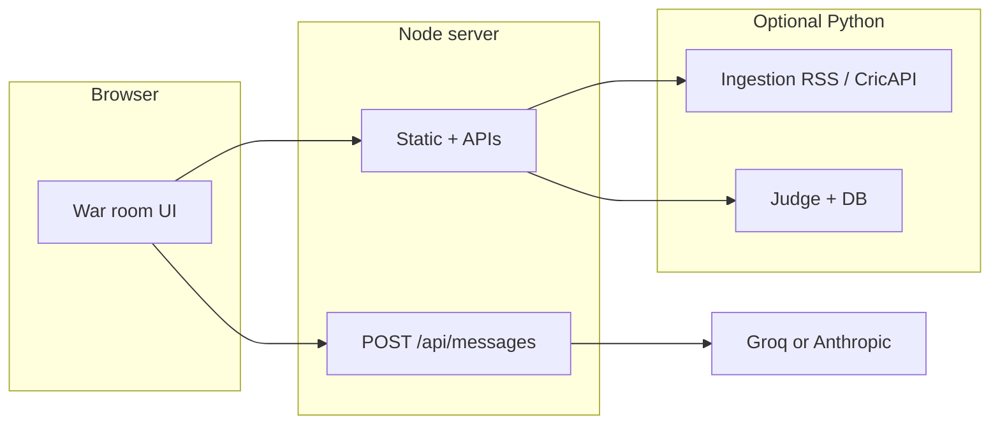

# Cricket War Room

> **Six AI roles debate a live fixture. One Judge delivers the verdict.**

Scout → Stats → Weather → Pitch → News → **multi-round Bull vs Bear** → structured prediction (winner, confidence, score band, key player, swing factor).

**[Live demo](https://cricket-war-room.onrender.com)** · **[Deploy your own](#deploy-to-render-free)** · **[Share a fixture](#share-links)**

**Disclaimer (read first):** this product is for **entertainment and fan discussion only**. AI outputs are **not** betting, trading, financial, or professional advice; they can be wrong. The live app repeats this below the header and in the footer.

---

## Why it exists

Most “AI sports” demos stop at a single headline prediction. The differentiator here is the **debate transcript**: two adversarial voices (Bull vs Bear) argue over the same grounded context across several rounds before the Judge synthesizes a verdict. That transcript is the asset—shareable, readable, and closer to how analysts actually disagree than a one-shot percentage.

**Positioning / timing:** Tournaments such as **IPL** concentrate search and social traffic for a short window (typically **late March–May**). If you care about discovery, ship **indexed pages, OG previews, and shareable URLs before the first match**, not mid-tournament.

**Example monetisation angles** (PoC only—not implemented as billing here): freemium caps on automated runs; fantasy-app referral partnerships; B2B API for publishers who want debate + verdict widgets.

---

## Architecture



1. User picks a fixture (`match_suggestions.json` or `GET /api/match-suggest`).
2. Optional **match context** from ingestion (`GET /api/match-context`) grounds the agents.
3. **Five intel agents** run in parallel via `POST /api/messages`.
4. **Bull vs Bear** multi-round debate uses the same context with opposing goals.
5. **Judge** returns strict JSON; optional **Judge service** stores predictions for accuracy.

---

## Judge accuracy & persistence

When the Judge API is enabled, the UI can show **running accuracy** (predictions where an actual winner was recorded vs the model’s pick).

- **Render free + file SQLite** (`WAR_ROOM_DB_PATH=/tmp/...`): the database **dies on restart**—fine for demos, weak for a credibility story.
- **Turso (libSQL)** — set on the **Judge** process:
  - `TURSO_DATABASE_URL` — e.g. `libsql://your-db.turso.io`
  - `TURSO_AUTH_TOKEN` — from the Turso dashboard  
  When both are set, the service uses **remote libSQL** via the `libsql` package (see `requirements-judge.txt`) and **ignores local file path** for storage. That turns accuracy into a metric that survives deploys and cold starts.

Create a DB in [Turso](https://turso.tech), install deps, run the judge as usual; no schema migration is required beyond the app’s `CREATE TABLE IF NOT EXISTS`.

---

## Share links

Open the app with a query string to pre-fill the fixture field (must match a row in `match_suggestions.json` or fallback rows):

```text
https://cricket-war-room.onrender.com/?share=IPL%202026%20%E2%80%94%20SRH%20vs%20DC%2C%20Hyderabad
```

After loading, the user still clicks **Run war room** (no surprise token spend on page view).

---

## Screenshots

### v3 — debate-first flow


*v3: the **multi-round Bull vs Bear** transcript is the hero surface; the Judge card closes the loop. Intel agents (Scout, Stats, Weather, Pitch, News) run in parallel earlier in the same session.*

**Also:** completed fixtures in `match_suggestions.json` can skip agents and debate and show a **Final result** card only — see `image/war-room-final-result.jpg`.

---

## Free-tier infrastructure (honest trade-offs)

| Piece | Limitation | Free / low-cost direction |
|-------|----------------|---------------------------|
| Render free web | Cold start ~30s after idle | [Railway](https://railway.app) ($5/mo credit), paid Render, or self-host Docker |
| SQLite on `/tmp` | Resets → accuracy looks fake | **[Turso](https://turso.tech)** remote libSQL (wired in `judge_service/predictions_db.py`) |
| CricAPI free tier | ~100 calls/day on busy days | RSS (ESPN + Cricbuzz) already used; CricAPI optional |
| No product analytics | You cannot improve what you don’t measure | e.g. [Umami](https://umami.is) self-hosted |
| Social previews | Need stable absolute `og:image` | Served from `/image/war-room-v3-demo.png` in production builds |

---

## Deploy to Render (free)

[](https://render.com/deploy)

1. Push this repo to GitHub.
2. [dashboard.render.com](https://dashboard.render.com) → **New** → **Blueprint** → select the repo (`render.yaml` provisions three services).
3. Set environment variables in the dashboard (minimum **`GROQ_API_KEY`** on `cricket-war-room` and `cricket-judge`; URLs for ingestion/judge as in the table below).
4. **Optional but recommended for Judge accuracy:** on `cricket-judge`, add **`TURSO_DATABASE_URL`** and **`TURSO_AUTH_TOKEN`** so predictions survive restarts.

| Service | Variable | Value |
|---------|----------|-------|
| `cricket-war-room` | `GROQ_API_KEY` | [console.groq.com](https://console.groq.com) |
| `cricket-war-room` | `INGESTION_SERVICE_URL` | `https://cricket-ingestion.onrender.com` |
| `cricket-war-room` | `JUDGE_SERVICE_URL` | `https://cricket-judge.onrender.com` |
| `cricket-ingestion` | `CRICAPI_KEY` | optional |
| `cricket-judge` | `GROQ_API_KEY` | same as above |
| `cricket-judge` | `TURSO_DATABASE_URL` / `TURSO_AUTH_TOKEN` | optional persistence |

> **Free-tier note:** web services **spin down** after idle — first request can take ~30s. Without Turso, **`WAR_ROOM_DB_PATH=/tmp`** still loses SQLite on restart.

---

## Run with Docker

```bash
cp .env.example .env   # fill GROQ_API_KEY (minimum)
docker compose up --build
```

Open [http://localhost:3333/](http://localhost:3333/). Judge data persists in the `judge_data` volume unless you override with Turso env on the judge container.

---

## Quick start (local, no Docker)

```bash
export GROQ_API_KEY="gsk_..."   # or ANTHROPIC_API_KEY
npm run start:dev               # dev: serves source from repo root
# Production bundle: npm run build && npm start   (Unix: SERVE_DIST=1; Windows CMD: set SERVE_DIST=1)
```

Opening `ai_cricket_war_room.html` over `file://` uses bundled fallback fixtures only; use the Node server for autocomplete and `/api/messages`.

---

## Configuration

| Variable | Purpose |
|----------|---------|
| `GROQ_API_KEY` / `ANTHROPIC_API_KEY` | LLM keys (Node + Judge). |
| `LLM_PROVIDER` | `groq` or `anthropic` to force. |
| `GROQ_MODEL`, `GROQ_MODEL_LIGHT`, `GROQ_MODEL_DEBATE` | Model mix (see `server.mjs` header). |
| `PORT` | Node port (default `3333`). |
| `SERVE_DIST` | `1` → serve hashed `dist/` assets. |
| `INGESTION_SERVICE_URL` / `JUDGE_SERVICE_URL` | Python service bases. |
| `CRICAPI_KEY` | On **ingestion** process; optional live scores. |
| `INGESTION_*` | RSS URLs, timeouts, cache TTL, `INGESTION_DISABLE`. |
| `WAR_ROOM_DB_PATH` | Judge **file** SQLite when Turso env is **not** set. |
| `TURSO_DATABASE_URL` + `TURSO_AUTH_TOKEN` | Judge **remote** DB (preferred on ephemeral disks). |
| `GROQ_JUDGE_MODEL` / `ANTHROPIC_JUDGE_MODEL` | Judge-only model overrides. |

---

## API (Node server)

- `POST /api/messages` — LLM proxy.
- `GET /api/match-suggest`, `GET /api/match-by-label` — fixtures.
- `GET /api/match-context` — proxy to ingestion.
- `GET /api/live-score` — fresh score snippet JSON.
- `POST /api/judge/predict`, `GET /api/judge/accuracy` — Judge proxy.
- `GET /api/version` — build metadata.

---

## Data: fixtures

Edit **`match_suggestions.json`**. Optional **`completed`** + **`result`** (`winner`, `summary`) skips agents/debate. Restart Node after edits. Mirror critical rows in **`MATCH_SUGGESTIONS_FALLBACK_ROWS`** in `ai_cricket_war_room.js` for offline `file://`.

---

## Project layout (short)

| Path | Role |
|------|------|
| `ai_cricket_war_room.{html,css,js}` | UI, debate flow, share param, prompts |
| `server.mjs` | Static host, APIs, `SERVE_DIST` |
| `scripts/build.mjs` | Production `dist/` + copies `icons/`, `image/` |
| `match_suggestions.json` | Fixture catalog |
| `ingestion_service/` | FastAPI RSS/CricAPI |
| `judge_service/` | FastAPI Judge + persistence |
| `render.yaml`, `docker-compose.yml`, `Dockerfile*` | Deploy |

---

## Appendix: AI / tooling context

Single-page **vanilla JS**; **Node 20** gateway; optional **FastAPI** ingestion + judge. Fixture JSON + in-JS fallback rows. Build hashes JS/CSS and rewrites HTML + service worker. Python judge: `POST /predict`, `GET /accuracy`, SQLite **or** Turso when `TURSO_*` set. See `judge_service/models.py` for verdict fields.

---

## License / assets

Team logos may load from public Wikimedia URLs in `ai_cricket_war_room.js`. Replace for production if needed.
