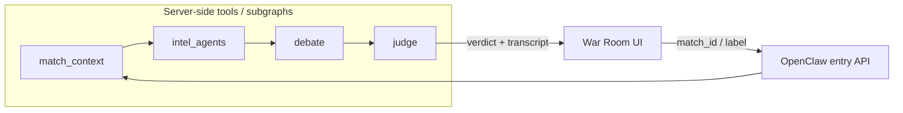

# OpenClaw (optional): tool nodes and thin client

This repo runs **orchestration in the browser** today (`runWarRoom()` in `ai_cricket_war_room.js` sequences `fetch` + LLM calls). If you later adopt **OpenClaw** (or any graph-style agent runtime), treat the pieces below as **tool nodes** or **subgraphs**. Keep **`ai_cricket_war_room.html` / `.js` / `.css` as the client**: they should only **submit inputs**, **poll or stream graph state**, and **render** the same stages (intel tiles, debate, verdict).

## Suggested graph shape

Order matches the current happy path: grounded context first, then parallel intel, then sequential debate, then judge.

## Tool node mapping (this repo)

| Node | Responsibility today | Re-home as |
|------|----------------------|------------|
| **match_context** | `GET /api/match-context` → Python `ingestion_service` (`build_match_context`) | Tool that returns `{ news_bullets, stats_tables, …, sources[], fetched_at }` for the selected fixture. Same query params: `label`, `teams`, `venue`, `date`. |
| **intel_agents** | Five `callClaude` calls in `runWarRoom()` with `buildAgentEvidenceString` + `INTEL_SYSTEM` | One subgraph with **five parallel LLM steps** (or one batched tool that runs five prompts). Input: `match_context` + match label + team names. Output: `insights` map keyed by agent id (`scout`, `stats`, …). |
| **debate** | Four sequential `callClaude` rounds (`rounds` array, `debateSystemBull` / `debateSystemBear`, growing `history`) | Subgraph: **state** = message history; each step appends user + assistant. Input: `buildMatchContextBlock(...)` equivalent (ingested bundle + specialist lines). Output: `debateLog` + plain-text **transcript** for the judge. |
| **judge** | Client-side judge prompt + JSON parse in `ai_cricket_war_room.js`, or optional `POST /predict` on `judge_service` | Tool that takes **`debate_transcript`** + **`match_id`** and returns `Verdict` (see `judge_service/models.py`). Prefer the existing service if you want persistence and `GET /accuracy`. |

**LLM access:** Today the UI posts to `POST /api/messages` via `server.mjs`. In an OpenClaw deployment, move those calls **into the graph workers** (same Groq/Anthropic env vars as `server.mjs`), so the browser never holds API keys for agent steps.

## Thin client contract

Keep in the browser only:

- Fixture search (`GET /api/match-suggest`, `GET /api/match-by-label`) and completed-match shortcut (same behavior as `lookupCompletedMatchRow`).
- **Run** action: `POST` to your OpenClaw workflow with e.g. `{ match_id, label, teams, venue, date }` (whatever the graph needs to call `match_context`).
- Rendering: fill intel tiles, debate bubbles, and verdict card from **structured events** or a final payload mirroring what `runWarRoom` assembles today.

Move out of the browser:

- Parallel intel `Promise.all`, debate loop, and judge LLM call — unless you intentionally keep judge client-side for a demo; production should align with one `Verdict` schema.

## Failure and degradation

Mirror current behavior: if ingestion returns empty sections, intel should still run with **evidence-bound** prompts and fallbacks; the graph should surface `fetched_at` and `sources` in the payload the UI already expects from `ingestedCtx`.

## Compliance

Ingestion respects site ToS and robots in production; swapping the **match_context** implementation (licensed feed vs RSS) does not change the tool boundary above.
